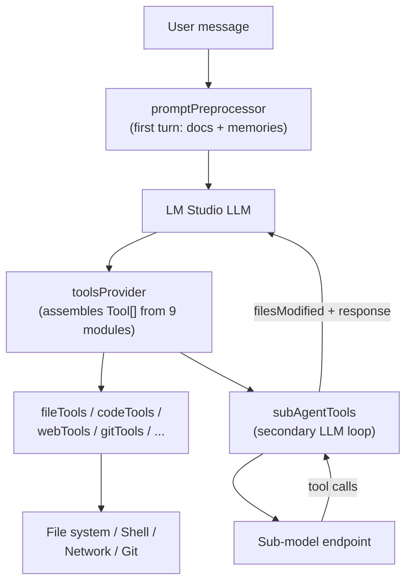

# Code Overview

High-level architecture reference for the LM Studio Toolbox plugin.

---

## Directory Structure

```
src/
  index.ts                   # Plugin entry point — registers config, tools, preprocessor
  config.ts                  # All user-configurable settings (pluginConfigSchematics)
  toolsProvider.ts           # Thin orchestrator: builds ToolContext, assembles tool list
  promptPreprocessor.ts      # First-turn injection: tools docs, memories, startup files
  stateManager.ts            # Persists CWD and message count to ~/.beledarians-llm-toolbox/
  toolsDocumentation.ts      # System prompt injected to the LLM on first turn
  subAgentToolCallParser.ts  # Parses tool calls out of sub-agent LLM responses
  toolCallValidator.ts       # Validates sub-agent tool call arguments before execution
  handoffMessage.ts          # Extracts [HANDOFF_MESSAGE] blocks from sub-agent responses
  fuzzySearch.ts             # Levenshtein-based fuzzy file path matching
  browserActions.ts          # Executes typed browser action sequences (Puppeteer)
  findLMStudioHome.ts        # Locates the LM Studio installation directory
  backgroundCommands.ts      # In-memory registry for long-running background processes
  locales/
    types.ts                 # LocaleDict TypeScript interface
    i18n.ts                  # Dual-layer i18n engine (OS locale + runtime selector)
    en.ts / de.ts / zh-CN.ts / zh-TW.ts
  tools/
    context.ts               # ToolContext interface — shared mutable state for all modules
    helpers.ts               # validatePath, safeFetch (SSRF guard), parseProtectedPaths,
                             #   cosineSimilarity, performRagOnText, getDenoPath, getPythonPath
    fileTools.ts             # File I/O: read, write, edit, search, navigate, delete
    codeTools.ts             # Code execution: JS (Deno sandbox), Python (audit-hook sandbox),
                             #   shell commands, terminal, background tasks
    webTools.ts              # Web: search (DDG/Google/Bing fallback chain), fetch, RAG, Wikipedia
    browserTools.ts          # Puppeteer browser sessions and one-shot page rendering
    gitTools.ts              # Git operations via simple-git (status/diff/add/commit/pull/push)
    githubTools.ts           # GitHub CLI wrapper (issues, PRs, auth)
    miscTools.ts             # Clipboard, open/preview, read_document, notify, query_database,
                             #   rag_local_files
    memoryTools.ts           # SQLite-backed persistent memory CRUD (save/list/search/update/delete)
    subAgentTools.ts         # consult_secondary_agent: full tool-calling loop for a sub-model

tests/
  browserActions.test.js          # executeBrowserActions unit tests
  fileTools.test.js               # createFileTools integration tests (real temp dir, 30 cases)
  fuzzySearch.test.js             # Levenshtein / fuzzy scoring unit tests
  handoffMessage.test.js          # extractHandoffMessage unit tests
  i18n.test.js                    # i18n locale resolution tests
  memoryTools.test.js             # createMemoryTools integration tests (SQLite, 13 cases)
  nodeNotifier.test.js            # Dynamic import regression for node-notifier
  promptPreprocessor.test.js      # getSubAgentDocsCandidatePaths unit test
  pythonSandbox.test.js           # Python audit-hook sandbox smoke tests (12 cases)
  security.test.js                # validatePath, parseProtectedPaths, safeFetch SSRF (23 cases)
  subAgentToolCallParser.test.js  # parseSubAgentResponseMessage (50 cases)
  subAgentValidation.test.js      # validateToolCall unit tests
```

---

## Core Concepts

### ToolContext

Every tool module receives a shared `ToolContext` object. `ctx.cwd` and
`ctx.browserSession` are **mutated in place** — always access them as object
properties, never destructure, so changes made by `change_directory` or browser
tools are immediately visible everywhere.

```typescript
interface ToolContext {
  cwd: string;                       // mutable — changed by change_directory
  browserSession: BrowserSession | null; // mutable — set by browser_session_open
  protectedPaths: string[];          // enforced by validatePath and change_directory
  client: LMStudioClient;
  pluginConfig: any;
  // permission flags: allowGit, enableMemory, allowBrowserControl, ...
}
```

### Security Boundaries

| Boundary | How it's enforced |
|---|---|
| Workspace path isolation | `validatePath()` blocks `..` traversal and absolute paths outside CWD |
| Protected paths | `protectedPaths` config parsed at startup; checked in `validatePath` and `change_directory` |
| SSRF prevention | `safeFetch()` in `helpers.ts` blocks loopback, RFC-1918, link-local, and cloud-metadata IPs |
| Browser URL schemes | `browser_session_open`/`browser_open_page` reject non-http(s) URLs |
| Python sandbox | `sys.addaudithook` blocks network, subprocess, and writes outside CWD |
| JavaScript sandbox | Deno with `--deny-net --deny-env --deny-sys --deny-run --deny-ffi` |

> **Note on `change_directory`:** intentionally allows navigating outside the
> initial workspace (the model needs to `cd ..`). After a directory change,
> `validatePath` re-roots against the new CWD. Use `protectedPaths` to
> block specific directories absolutely.

See `SECURITY.md` for the full trust model and dependency advisory status.

### Dual-Layer i18n

- **Layer 1 (Config UI):** Detected from OS locale at plugin boot via
  `getSystemDict()`; immutable per SDK constraints. Override with
  `uiLanguageOverride` (takes effect on restart).
- **Layer 2 (Runtime messages):** Read per-turn from `messageLanguage` config;
  hot-switchable without restart.

### Sub-Agent Loop

`consult_secondary_agent` sends messages to a secondary LLM endpoint in a loop
(up to 8 iterations or the `subAgentTimeLimit` wall-clock deadline). The response
is parsed by `subAgentToolCallParser.ts`, which handles many output formats:
OpenAI `tool_calls`, JSON-in-content, legacy `call:` syntax, and
reasoning-model thinking blocks. Recognised tool calls are dispatched to inline
handlers; `finish_task` and `TASK_COMPLETED`/`TASK_FAILED` in content both
terminate the loop cleanly.

### Memory

Stored in `.memories.db` (SQLite) in the current workspace. The connection is
cached per-path at module level — one open/schema-check per session. Legacy
`memory.md` bullet entries are migrated on first access. The 50 most-recent
entries are injected into the LLM context on the first turn of every
conversation.

---

## Data Flow


